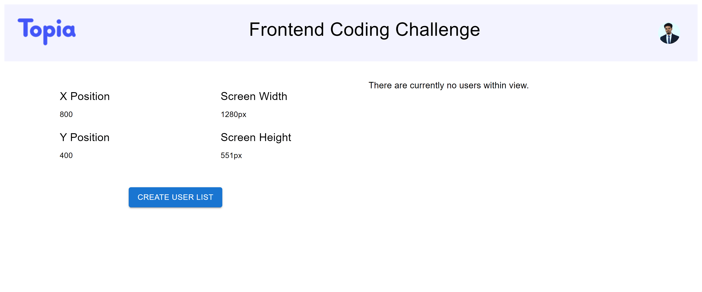

<a name="readme-top"></a>

<div align="center">
  

  <h3 align="center">Frontend Coding Challenge</h3>

  <p align="center">
    A Frontend Coding Challenge from Topia. Done by Abel.
    <br />
    <br />
    <a href="https://github.com/othneildrew/Best-README-Template">View Demo</a>
    
  </p>
</div>

<!-- ABOUT THE PROJECT -->

## About The Project

  [](public/demo.gif)

This project demonstrates a simple replica of the core algoritm used in Topia's spatial communication software.

<p align="right">(<a href="#readme-top">back to top</a>)</p>

### Built With

- [![React][React.js]][React-url]
- [![TypeScript]][TypeScript-url]
- [![Material-UI][Material-UI]][Material-UI-url]
- [![Jest]][Jest-url]
- [![ESLint]][ESLint-url]
- [![Vite]][Vite-url]

<p align="right">(<a href="#readme-top">back to top</a>)</p>

<!-- GETTING STARTED -->

## Getting Started

To get a local copy up and running follow these simple steps.

### Prerequisites

You must have a package manager like npm installed.

- npm
  ```sh
  npm install npm@latest -g
  ```

### Installation

1. Clone the repo
   ```sh
   git clone https://github.com/abel-tefera/topia-frontend-challenge--abel.git
   ```
2. Install NPM packages
   ```sh
   npm install
   ```
3. Start the dev server
   ```sh
   npm run dev
   ```
4. (Optional) Run tests
   ```sh
   npm run test
   ```

<p align="right">(<a href="#readme-top">back to top</a>)</p>

## Usage

- Update values of the screen size and user's position by submitting
  the form in the modal.
- Once submitted, peer avatars which are in the user's viewport will be displayed on the table. These values are calculated from `listUsersInView`

## Acknowledgements

- I would like to thank [Topia](https://www.topia.io/) for giving me the opportunity to work on this challenge.

## Contact

Abel Tefera - [@linkedin](https://www.linkedin.com/in/abel-t-belay/) - abeltefera16@gmail.com

Project Link: [https://github.com/abel-tefera/topia-frontend-challenge--abel](https://github.com/abel-tefera/topia-frontend-challenge--abel)

<p align="right">(<a href="#readme-top">back to top</a>)</p>

<!-- MARKDOWN LINKS & IMAGES -->
<!-- https://www.markdownguide.org/basic-syntax/#reference-style-links -->

[product-screenshot]: images/screenshot.png
[React.js]: https://img.shields.io/badge/React-20232A?style=for-the-badge&logo=react&logoColor=61DAFB
[React-url]: https://reactjs.org/
[Material-UI]: https://img.shields.io/badge/Material--UI-0081CB?style=for-the-badge&logo=material-ui&logoColor=white
[Material-UI-url]: https://material-ui.com/
[Jest]: https://img.shields.io/badge/Jest-C21325?style=for-the-badge&logo=jest&logoColor=white
[Jest-url]: https://jestjs.io/
[TypeScript]: https://img.shields.io/badge/TypeScript-007ACC?style=for-the-badge&logo=typescript&logoColor=white
[TypeScript-url]: https://www.typescriptlang.org/
[ESLint]: https://img.shields.io/badge/ESLint-4B32C3?style=for-the-badge&logo=eslint&logoColor=white
[ESLint-url]: https://eslint.org/
[Vite]: https://img.shields.io/badge/Vite-646CFF?style=for-the-badge&logo=vite&logoColor=white
[Vite-url]: https://vitejs.dev/
